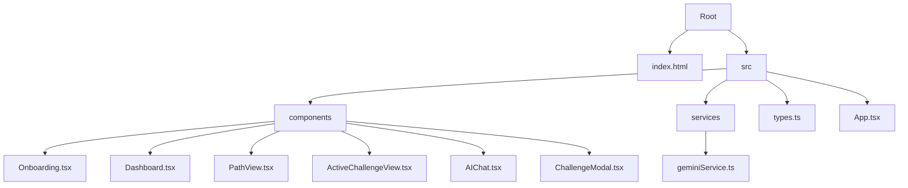
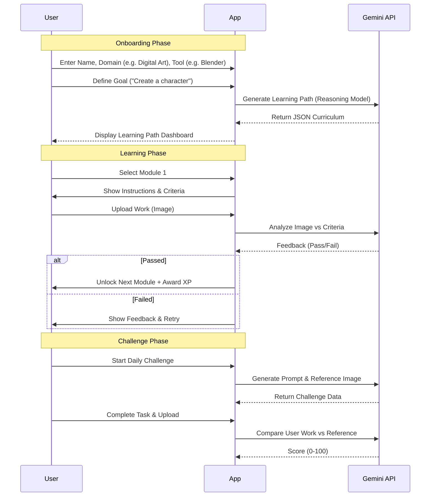

# Artifex AI Documentation

## 1. Feature Overview

Artifex AI is an intelligent mentor designed to help users master complex creative software like Blender, AutoCAD, and Maya.

### Core Features

1.  **Personalized Learning Paths (Gemini 3 Pro)**
    -   Users input their domain, tool, and specific goal.
    -   The AI generates a structured curriculum with sequential modules.
    -   Each module includes a description, success criteria, and step-by-step breakdown.

2.  **AI-Powered Submission Review (Multimodal)**
    -   Users upload screenshots or renders of their work.
    -   Gemini analyzes the image against the module's success criteria.
    -   Provides real-time feedback: "Passed" with praise or "Revision Needed" with specific corrections.

3.  **Daily Challenges (Gemini 2.5 Flash)**
    -   Daily "Sprint" challenges generated based on user skill level.
    -   Includes a target reference image generated by Gemini (Imagen) for the user to recreate.
    -   Gamified timer with Gold/Silver/Bronze tiers.

4.  **Artifex Copilot (Context-Aware Chat)**
    -   A persistent chat assistant aware of the user's current module and tool.
    -   Can answer technical questions, explain shortcuts, and even "Magic Edit" user images to visualize improvements.

## 2. Project Structure

### Key Components

-   **App.tsx**: Main state container. Handles routing (view switching) and global user state.
-   **geminiService.ts**: Centralized API layer. Handles all calls to Google GenAI SDK, including JSON parsing and error handling.
-   **PathView.tsx**: The core learning interface. Displays the module flowchart and handles file submissions.
-   **ActiveChallengeView.tsx**: The gamified mode for daily challenges with a timer and reference image comparison.

## 3. User Workflow

The following diagram illustrates the typical user journey through the application.

